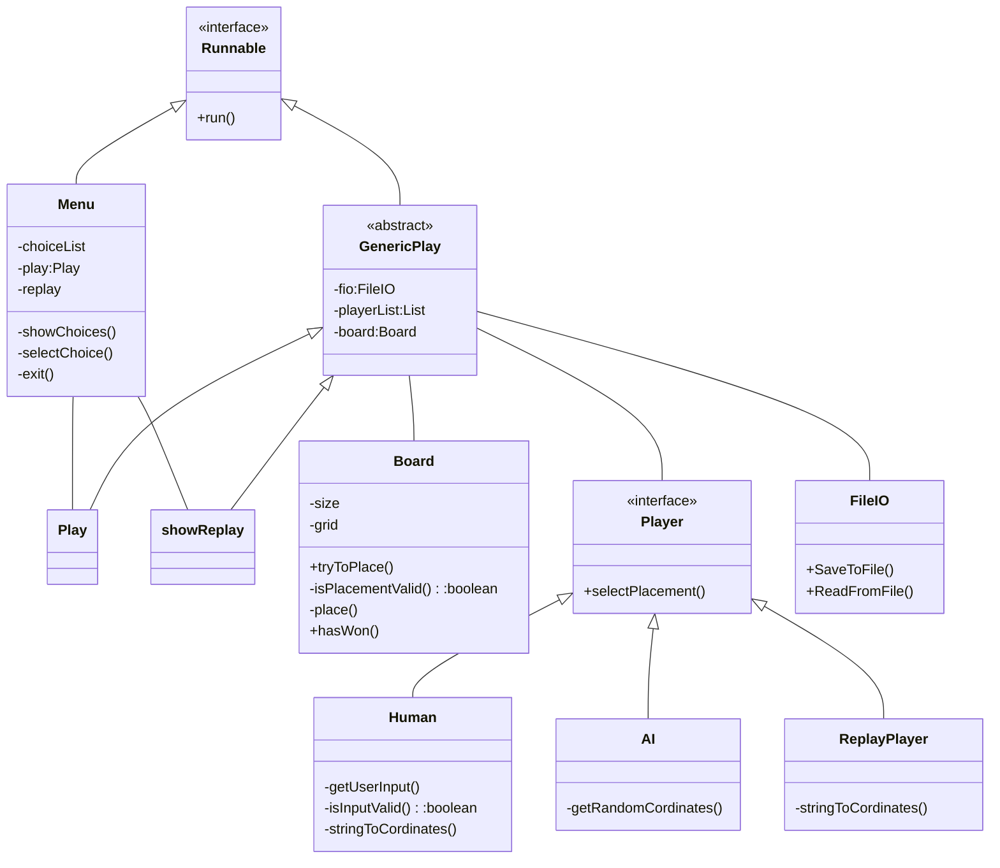
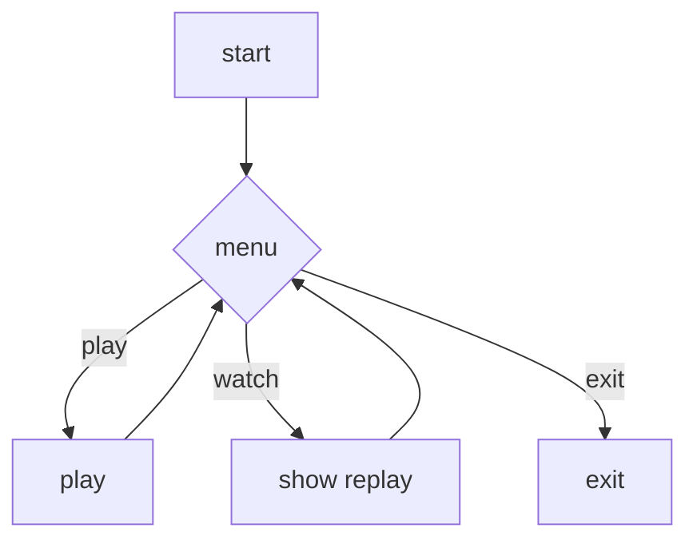
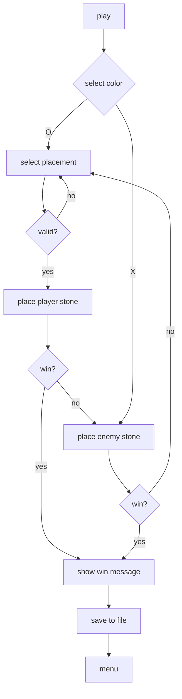
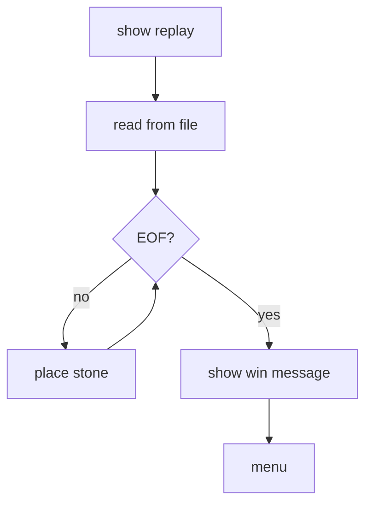

# Design
## Class Diagram

```mermaid
classDiagram
%% classes
    class Runnable {
        <<interface>>
        +run()
    }

    class Menu {
        -choiceList
        -play:Play
        -replay
        -showChoices()
        -selectChoice()
        -exit()
    }

    class GenericPlay {
        <<abstract>>
        -fio:FileIO
        -playerList:List<Player>
        -board:Board
    }

    class Play {
    }

    class showReplay {
    }

    class Board {
        -size
        -grid
        +tryToPlace()
        -isPlacementValid():boolean
        -place()
        +hasWon()
    }

    class Player {
        <<interface>>
        +selectPlacement()
    }

    class Human {
        -getUserInput()
        -isInputValid():boolean
        -stringToCordinates()
    }

    class AI {
        -getRandomCordinates()
    }

    class ReplayPlayer {
        -stringToCordinates()
    }

    class FileIO {
        +SaveToFile()
        +ReadFromFile()
    }

%% arrows
    Runnable <|-- Menu
    Runnable <|-- GenericPlay

    Menu -- Play
    Menu -- showReplay

    GenericPlay <|-- Play
    GenericPlay <|-- showReplay

    GenericPlay -- FileIO
    GenericPlay -- Player
    GenericPlay -- Board

    Player <|-- Human
    Player <|-- AI
    Player <|-- ReplayPlayer
```

## Flowchart
### Abstract

```mermaid
graph TD
%% names
    S[start]
    M{menu}
    P[play]
    R[show replay]
    X[exit]
%% arrow
    S --> M
    M -->|play| P
    M -->|watch| R
    M -->|exit| X
    P --> M
    R --> M
```
### Play

```mermaid
graph TD
%% names
    P[play]
    C{select color}
    V{valid?}
    SP[select placement]
    PPS[place player stone]
    PES[place enemy stone]
    PW{win?}
    EW{win?}
    S[save to file]
    WM[show win message]
    M[menu]
%% arrows
    P --> C
    C -->|O| SP
    SP --> V
    V -->|no| SP
    V -->|yes| PPS
    PPS --> PW
    PES --> EW
    PW -->|no| PES
    C -->|X| PES
    EW -->|no| SP
    PW -->|yes| WM
    EW -->|yes| WM
    S --> M
    WM --> S
```
### show replay

```mermaid
graph TD
%% names
    SR[show replay]
    RF[read from file]
    PS[place stone]
    EOF{EOF?}
    WM[show win message]
    M[menu]
%% arrows
    SR --> RF
    RF --> EOF
    EOF -->|yes| WM
    EOF -->|no| PS
    PS --> EOF
    WM --> M
```